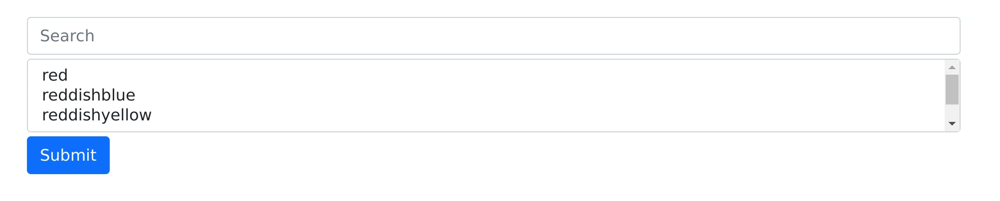

# Simple Search

A tiny helper that filters a list as you type and populates a select element with 
the matched options and provides ergonomic keyboard control.

## How it works

Type in the string you want to search, then if using a keyboard, you can use
the up/down arrows to navigate. The script will search each given item for the
string. It is case-insensitive.



Note that this script is unopinionated when it comes to style. You pass in your
own input and select elements, so style them however you like. I've just used a
basic Bootstrap style in the above GIF.

## Usage
I don't plan to update this much, as it is so tiny and stable, so I haven't 
added it to NPM. You can clone the repo and add it to your project however you 
like.

```
SimpleSearch(items, inputEl, selectEl);
```

Note that items should be an array of objects, each of which has 
the properties "searchable" and "value." Searchable is what will appear to the 
user and is the subject of the search. Value will be what goes in the value 
attribute of the option element. For example, value might be the customer ID,
and searchable the customer name.
